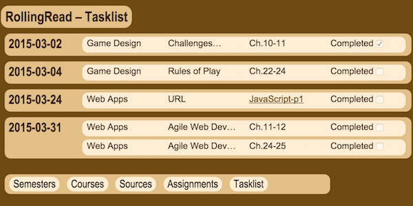

# Proposal for project 2 &lsquo;beta-app&rsquo;

### Team

* GitHub organization: [spring15wad](https://github.com/spring15wad)
  * Dan Martin ([thedanmartin](https://github.com/thedanmartin))
  * Josh Highnight ([jhignight](https://github.com/jhignight))
  * Mike Freeman ([mfreema5](https://github.com/mfreema5))

## &ldquo;RollingRead&rdquo;

### Purpose

RollingRead is a rolling reading list, something of a cross between a task list and a calendar.  The app presents a university student with the reading assignments for the student's classes, organized and sorted by due date.

### Scope

* RollingRead only uses data (textbooks names, course meeting times, etc.) entered by the user 
* Users can enter URLs to have assignments link to external resources

----

