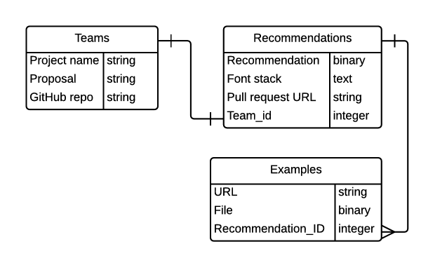

#Project 4 &ndash; an alternative

(Presuming our Project 2/3 does *not* also incorporate Project 4.)

* **Basic concept**: We recommend font stacks for the projects of the three undergraduate teams
 * (Note: Recommendations are not generated automatically, or anything like that. So, Rails is probably overkill, but it seems like a worthwhile way to get some more practice with it, if nothing else.)
* **Mechanics**
  * Ruby on Rails web app; teams enter into it:
    * Project name
    * Copy of proposal
    * GitHub repository URL
  * We will then enter into that same app
    * A brief document giving our recommendation
    * The font stack
    * Examples
      * URLs to similar uses of similar fonts
      * Screenshots of similar sites/apps, the fonts in their app, etc.
    * URL of a pull request on their repo that incorporates the recommended fonts
 
No `OAuth`, no usernames/passes. (Unless there's some quick and easy way to do that, maybe using GitHub's tokens?)  This is not a full-fledge app, but just something to facilitate the recommendations.
 
The deadline would need to be before April 28th, so that teams could potentially use the fonts in the version of their app that they present.  Let's assume:  
 * Tuesday, April 21st

(The advantage to us of pushing up the deadline is that we get it out of the way before the crunch at the end of the semester.)

**The Big Problem**: where would this RecoFont app be hosted?  Could we host it in the Gewgawlab somehow?  If we throw a server (maybe a Raspberry Pi or summat?) onto the IIT LAN, is it inherently behind a firewall?

----

## Sketch of tables

